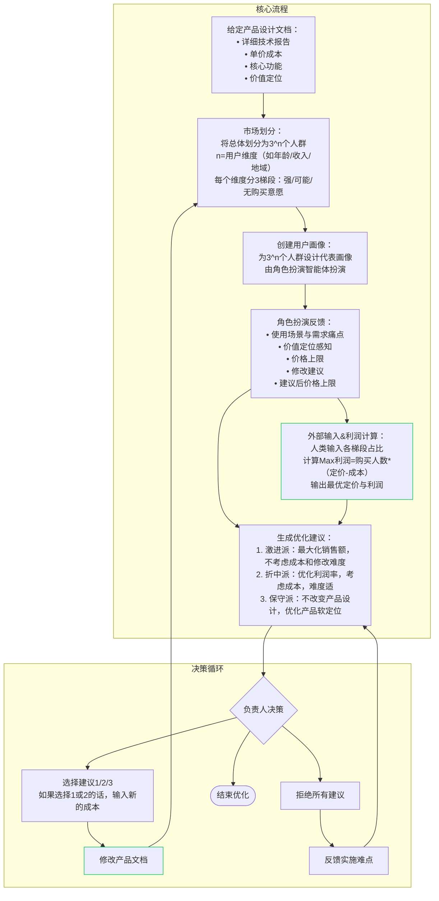
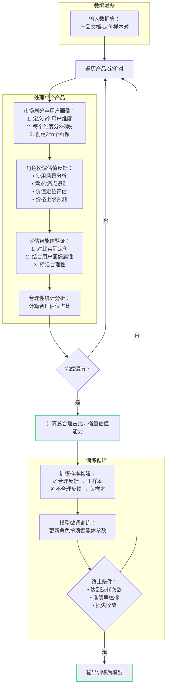
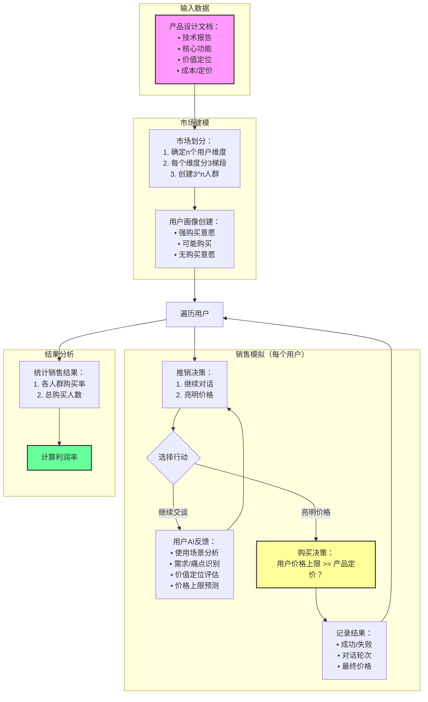
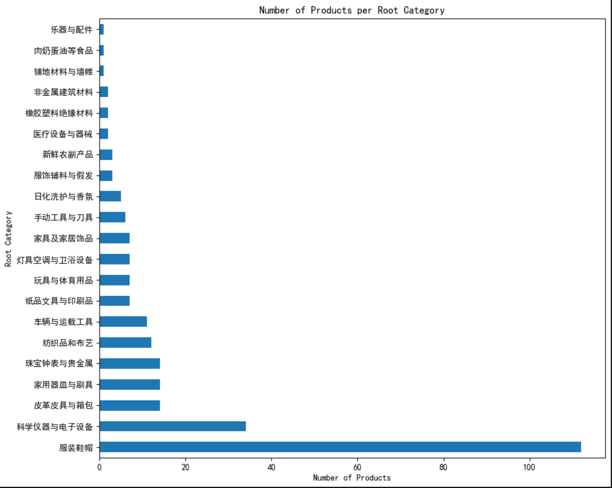
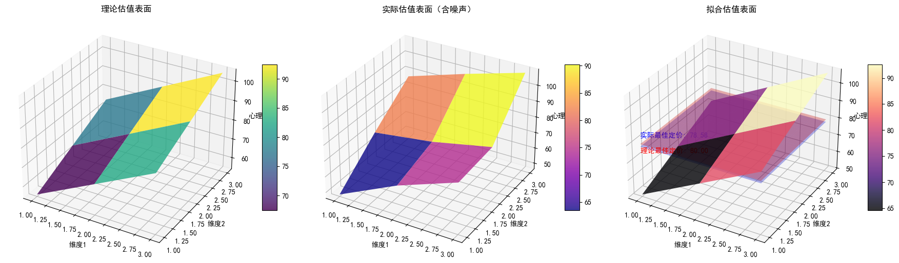

# 销售助手项目 - 基于大语言模型的产品定价优化研究

## 项目概述

本项目旨在通过大语言模型技术优化产品设计文档流程，评估和训练大语言模型的用户划分和估值能力，并模拟真实市场反馈来评估产品设计的好坏。

## 核心研究内容

### 1. 产品设计文档流程优化

**目标**：通过智能化的市场分析和用户反馈，优化产品设计文档，实现利润最大化。

**核心工作流程**：


**当前状态**：核心工作流程尚未实现

### 2. 大语言模型用户划分和估值能力评估

**目标**：评估和训练大语言模型在用户群体划分和产品估值方面的能力。

**实现流程**：


**当前状态**：正在实现数据准备部分

### 3. 市场反馈模拟评估

**目标**：通过模拟真实市场环境，评估产品设计的市场表现。

**主流程**：


**当前状态**：主流程的测试评估尚未实现

## 理论基础

### 用户划分能力和估值能力评估

#### 评估维度

**估值能力**：
- 群内稳定性（同一人群多次测试，定价的方差）
- 最佳定价与实际定价的差距
- 不同产品差距的稳定性

**用户群体划分能力**：
- 与线性加性模型的距离（维度间是否正交，每个维度是否线性）
  - 是否正交：VIF衡量每个变量，奇异值分解条件指数衡量整体、相关系数矩阵衡量两两之间的相关性
  - 是否线性：拟合$R^2$、线性趋势检验
- 每个维度对估值影响的程度$\beta_i$（各个价值特征的重要性）

#### 训练方法

- **用户划分**：选择线性加性最好的结果作为正样本
- **估值**：先确定理想$P_{the}$（由$P_{org}$拟合，并且平移到最佳定价=p的位置），然后缩小与之差距

### 定价理论参考

1. **认知价值定价法（Perceived-Value Pricing）**
   - 企业按照消费者在主观上对该产品所理解的价值，而不是产品的成本费用水平来定价

2. **价格断裂点模型 (Gabor-Granger)**
   - 需求与价格的关系，计算利润最大化

3. **价格敏感度测量（Price Sensitivity Measurement, PSM）**
   - 更复杂的需求-价格关系

### 理论模型

已知$P_{org}$（实际价格预测结果数据）和产品实际定价$p$，估计$P_{the}$

**理论值的标准**：
1. $\pi(p)=(p-成本)*\sum_{\vec{x}}{[f(\vec{x})*\epsilon(P_{the}(\vec{x})-p)]}$对于$p$最大（市场回报率最高）
   - 简化为$\sum_{\vec{x}}{P_{the}(\vec{x})*f(\vec{x})}=p$
2. $P_{the}(\vec{x})$应该在仿射变换后得到固定的某个理论形状
   - $P_{the}(\vec{x})=\beta_0+\sum_{i=1}^N\beta_ix_i$
3. 理论映射的每个维度的方差等于实际值

**差异计算**：
$$diff(\vec{x}) = [P_{the}(\vec{x})-P_{org}(\vec{x})]/p*100\%$$

**理论形状（高维平面）**：**线性加性**模型

**加性参考理论**：**特征价格模型 (Hedonic Pricing Model)**（商品价格由不同的几个维度贡献得到）

线性为合理假设：
$$P_{the}(\vec{x})=\beta_0+\sum_{i=1}^N\beta_ix_i$$

**计算方法**：
$$\hat{\beta}_i = \frac{\operatorname{Cov}(x_i, P_{\text{org}})}{\operatorname{Var}(x_i)}$$

## 数据集

### 可用数据集

| 名称链接 | 产品字段 | 定价字段 | 产品分布情况 | 规模 | 是否免费下载 | 备注 |
|----------|----------|----------|--------------|------|--------------|------|
| [E-Commerce Data](https://www.kaggle.com/datasets/carrie1/ecommerce-data/data) | 有简短文本描述 | 可能为英镑，可能为批发价 | 礼品 | - | 是 | 2010年12月1日至2011年9月12日期间发生的英国注册非商店在线零售的所有交易。公司主要销售独特的各种场合礼品。公司的许多客户都是批发商。 |
| [Text2Price](https://github.com/waheebo/Text2Price) | 有较长文本描述 | 有定价 | 科学仪器 | - | 是 | - |
| **[Flipkart产品](https://www.kaggle.com/datasets/PromptCloudHQ/flipkart-products)** | 有名称、多级分类、图片，描述、结构化信息等 | 有定价 | 零售产品，较全（待验证） | 20000（是另一个超580W的数据集的子集） | 是 | **当前使用的主要数据集** |

### 数据集分布情况



### 线性加性模型拟合



## 实现计划

1. [x] 分析数据集的场景多样性
   - ~~根据《类似产品和服务区分表》的分类标准，先为三十四类产品各起一个分类名，然后撰写将产品分类的提示词（产品文档+提示词→分类结果（给出第...类，然后用代码解析））~~
   - 对所有产品分类，统计每类中的产品个数，画出直方图/饼图等（对各个子数据集分别分析）
   - 撰写划分提示词。产品文档+提示词→输出文本解析→维度名+n*3个分类标准文本(list[dict[str, list[str]]])
   - 如果测试集在每一类中均有产品（分布较均匀），直接用测试集做后续测试，否则按每一类固定几个的原则随机抽取34*k个样本作为自己的测试集
2. [x] 对各个分类的占比做个大概其统计可视化，基本没问题就行，别花太大功夫
3. [x] 均衡的抽样出一个子集（大概100个产品左右吧，后面几步测试的时候先拿一两个产品走一下全流程试试效果，不用一上来全生成完，先跑通），分布尽量均匀
4. [x] 给每个产品生成设计文档
5. [ ] 给每个产品生成N个正交用户维度（一定要强调正交，且维度一定要和对产品的需求大小密切相关），以及每个维度的3个梯段划分标准
   - 撰写划分提示词。产品文档+提示词→输出文本解析→维度名+n*3个分类标准文本(list[dict[str, list[str]]])
6. [ ] 每个产品为3^N个用户群体分别生成一个用户画像（这里先不考虑多种收入群体，你把你上次觉得比较靠谱的那个月收入输入给他，让它作为画像的一部分就行）
7. [ ] 获取M*3^N个估值（最大可接受价格）
8. [ ] 让AI去估计每个产品的N个维度中，每个维度三个梯段的人群占比
9. [ ] 用实际估值和人群占比计算最佳定价（让销售额最大的定价），计算该定价与产品实际价格的误差，作为1个评价指标
10. [ ] 拟合理论估值模型（先拟合~~，再平移，使得用该模型算得的最佳定价=产品实际价格~~）
11. [ ] 分析实际估值效果（每个产品每个用户的实际估值与理论估值的相对误差，以及相对误差的加权平均值），作为第2个评价指标

## 输出格式规范示意

### 用户维度划分输出格式

```markdown
<response>
<dim name="[维度名]">
<第一档划分标准>[购买意愿最强的梯段的人群划分标准（只在该维度上）]</第一档划分标准>
<第二档划分标准>[购买意愿次强的梯段的人群划分标准（只在该维度上）]</第二档划分标准>
<第三档划分标准>[购买意愿最弱的梯段的人群划分标准（只在该维度上）]</第三档划分标准>
</dim>
<dim name="[维度名]">
<第一档划分标准>[购买意愿最强的梯段的人群划分标准（只在该维度上）]</第一档划分标准>
<第二档划分标准>[购买意愿次强的梯段的人群划分标准（只在该维度上）]</第二档划分标准>
<第三档划分标准>[购买意愿最弱的梯段的人群划分标准（只在该维度上）]</第三档划分标准>
</dim>
...
</response>
```

## 项目文件结构

```
SalesAssistant/
├── README.md                    # 项目说明文档（本文件）
├── main.ipynb                  # 主要数据分析笔记本
├── generate_documents.py       # 产品设计文档生成脚本
├── classify_category.py        # 产品分类脚本
├── utils.py                    # 工具函数（LLM调用等）
├── product_documents.csv       # 生成的产品设计文档
├── samples.csv                 # 抽样产品数据
├── classified_products.csv     # 分类后的产品数据
├── categories.csv              # 产品类别定义
├── flipkart_com-ecommerce_sample.csv  # Flipkart原始数据集
├── pictures/                   # 图表和图片资源
└── __pycache__/               # Python缓存文件
```

## 技术架构

### 核心组件

1. **数据预处理模块**：处理Flipkart电商数据集，进行产品分类和抽样
2. **文档生成模块**：基于产品信息生成标准化的产品设计文档
3. **分类模块**：将产品按类别进行智能分类
4. **LLM接口模块**：提供与大语言模型的交互接口
5. **评估模块**：评估模型性能和结果质量

### 技术栈

- **Python**：主要编程语言
- **Pandas**：数据处理和分析
- **Matplotlib**：数据可视化
- **OpenAI API**：大语言模型调用
- **Jupyter Notebook**：交互式开发和实验

## 使用说明

### 环境配置

1. 安装Python依赖包
2. 配置环境变量（API密钥等）
3. 准备数据集文件

### 运行流程

1. 数据预处理：运行`main.ipynb`进行数据分析和抽样
2. 文档生成：运行`generate_documents.py`生成产品设计文档
3. 产品分类：运行`classify_category.py`进行产品分类
4. 后续步骤：按实现计划逐步完成剩余任务

## 项目状态

- **当前阶段**：数据准备和基础功能实现
- **完成度**：约40%
- **主要成果**：产品文档生成、分类系统、数据预处理流程
